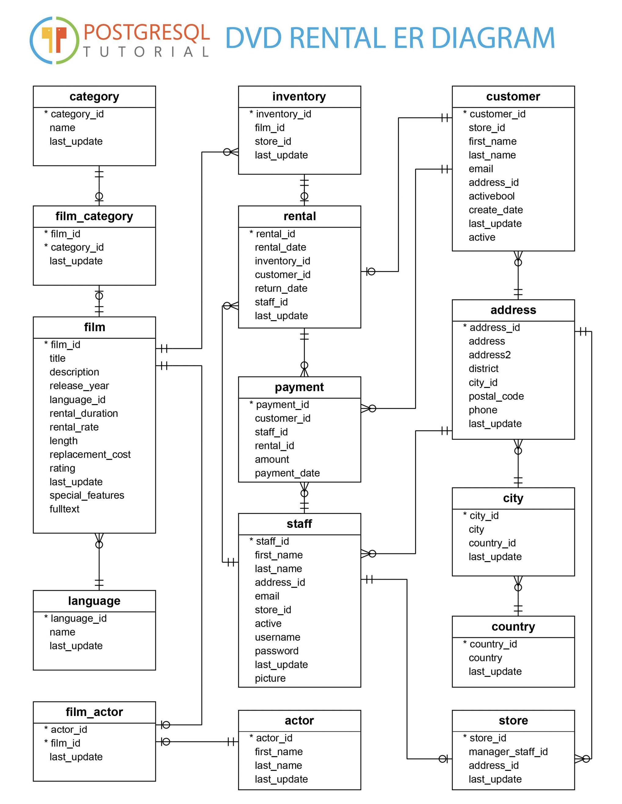

# test-db-pg-dvdrental
PostgreSQL DVD Rental database very useful to test purposes and playing with queries.

The idea was to create Docker image containing ready to use database example with sample data. 
I used sample database from PostgreSQL Tutorial and created Dockerfile to run postgres and restore db from backup.
 
 
## Useful links
- [Docker documentation](https://docs.docker.com/)
- [Postgres image](https://hub.docker.com/_/postgres/)
- [PostgreSQL Tutorial](http://www.postgresqltutorial.com/postgresql-sample-database/)

## PostgreSQL Tutorial ER Diagram


## Startup
To create and run the container with the dvdrental database, just clone the repo, cd to the folder and run ./startup.sh.
```bash
git clone https://github.com/fernandomsant/test-db-pg-dvdrental.git
cd test-db-pg-dvdrental
./startup.sh
```
It will prompt a few questions and it's done.
The database service will be available at the specified port (5432 for default)
<br>Example output:
```
 ./startup.sh
>> Choose one option:
>> 1) Automatic Configuration (default)
>> 2) Manual Configuration
>> 3) Skip Configuration
2
>> Manual Configuration ...
>> Set database name [dvdrental]: 
>> Set postgres user [dvdrental]: fernando
>> Set postgres user password [dvdrental]: 
>> Set host port to run the service [5432]: 8679
[...]
```

## Connect to the database
```
psql -h localhost -p 8679 -U fernando -d dvdrental --quiet
>> Password for user fernando: 
dvdrental=# ;
dvdrental=# SELECT * FROM actor WHERE actor_id = 1;
 actor_id | first_name | last_name |      last_update       
----------+------------+-----------+------------------------
        1 | Penelope   | Guiness   | 2013-05-26 14:47:57.62
(1 row)
[...]
```